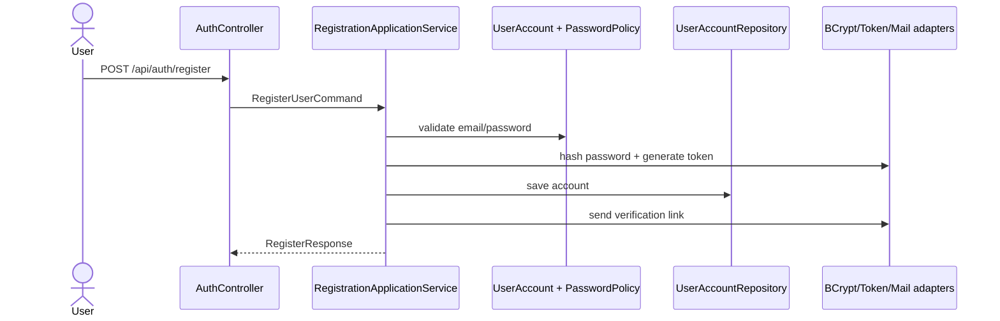
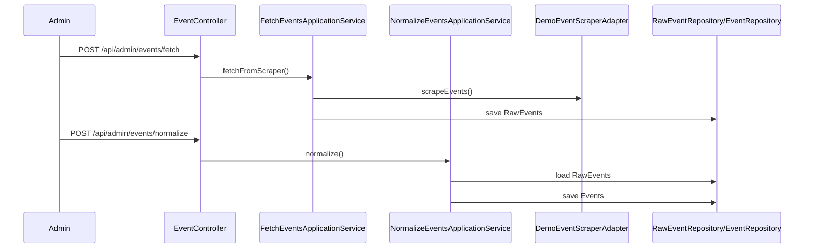

# Architektura backendu

Projekt jest modularnym monolitem w stylu DDD + Hexagonal Architecture.

## Bounded contexts

```text
com.example.springboot_backend
├── account
├── event
├── favorite
├── notification
└── shared
```

## Wzorzec w każdym kontekście

```text
context
├── api             # adapter wejściowy REST
├── application     # przypadki użycia, command/query, DTO, porty integracyjne
├── domain          # model domenowy, value objects, repozytoria jako porty, domain services, events
├── infrastructure  # adaptery wyjściowe: JPA, sender, hasher, token generator, scraper demo
└── mapper          # mapowanie domain -> DTO
```

## Najważniejszy przepływ: rejestracja i logowanie



## Przepływ wydarzeń



## Integracja między kontekstami

Konteksty nie sięgają bezpośrednio do obcych tabel. Komunikują się przez porty aplikacyjne:

- `AccountAccessPort` — favorite/event/notification pytają o użytkownika i sesję.
- `EventAvailabilityPort` — favorite/notification pytają, czy wydarzenie jest dostępne.
- `FavoriteEventsAccessPort` — notification sprawdza, czy event jest w ulubionych.
